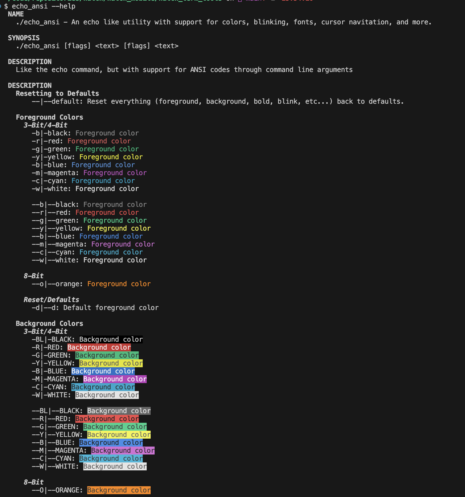

# About 

This repo contains a handful of useful shell utilities. Some are shell scripts, some are compiled Swift code ([see HatchTerminal](https://github.com/hatch-mobile/HatchTerminal)).


# Installation
To install shell tools, copy / paste this into your terminal

```sh
/bin/zsh -c "$(curl -fsSL https://raw.githubusercontent.com/hatch-mobile/hatch_term_tools/main/install_tools.sh)"
```

Refresh your environment
```sh
source ~/.zshrc`
# or restart Terminal.app
```

## Testing your installation

Test that the tools and path are installed:
```sh
which zing
# ~/.hatch/bin/zing
```

```sh
zing --version
# 2.0.3
```


# About the Tools

## `zing`
A CLI tool to assist in creating new `HatchModules`: 
* Creates boilerplate folders, files
* Updates `Package.swift` with new module. 
* Adds default `DocC` folder, files
* Adds `UnifiedLogger.swift` (a standardized wrapper for `os.Logger`)
* Generates starting Swift files/code. `Live.swift`, `Interface.swift`, etc...
* Adds starting `unit`, `integration`, and `UI` tests
* Supports `--dry-run` (like a preview)
* Written in `Swift`, easy to modify

Show help for the `create` subcommand
```sh
zing create --help
```

To learn more, see [ZING.md](ZING.md)

## `echo_pretty`


```
echo_pretty "This works just like echo does."
echo_pretty "This works just like echo does." --red --bold "WITH " --italic --YELLOW "COLORS" --default
echo_pretty "Even with " --blink "blinking urls" --cyan --underline "https://github.com" --default
```

Modeled from `echo`, but supports ANSI colors, cursor controls, etc... Compiled [Swift code](https://github.com/hatch-mobile/HatchTerminal/blob/main/Sources/EchoPretty/main.swift). Much faster than `echo_ansi`, but bigger in size.


## `echo_ansi`
Modeled after `echo`, but supports ANSI colors. Written as shell script. Slower than `echo_pretty`. 



## `hatch_log`
A utility for logging from other shell scripts. Compiled [Swift code](https://github.com/hatch-mobile/HatchTerminal/blob/main/Sources/HatchLogApp/main.swift)
Compiled Swift code.


# Uninstall

```sh
# Use the install script to clean up
./install_tools.sh --mode=uninstall
```

## Manual
```sh
# delete PATH lines from .zshrc
first_line=$(grep -n "# This section added by /bin/zsh" ~/.zshrc | cut -d ":" -f 1 | head -n 1)
second_line=$((first_line+1))
if [[ "$first_line" == "" || "$second_line" == "" ]]; then
  return 1
fi
sed -i '' -e "${first_line},${second_line}d" ~/.zshrc

# Reload env/path
echo "before: $PATH"
export PATH=$(echo "\$PATH" | sed -e "s|$HATCH_TOOLS_DIR||g")
echo "after: $PATH"
source ~/.zshrc

# delete hatch tools dir
HATCH_TOOLS_DIR='$HOME/bin/hatch'
rm -rf "$HATCH_TOOLS_DIR"
```

---

# Development of the Tools and Deployment

* The source code for the tools themselves resides in [hatch-mobile/HatchTerminal](https://github.com/hatch-mobile/HatchTerminal)
* The compiled tools are commmited in this repository which is used as an installer [hatch-mobile/hatch_term_tools](https://github.com/hatch-mobile/hatch_term_tools)


* Compiles all binaries in `HatchTerminal` repo. 
* Copies tools from build dir into hatch_term_tools/tools before finally comitting/pushing


## From `hatch_term_tools` (this repo)
```sh
# Compiles all binaries in `HatchTerminal` repo. 
../HatchTerminal/scripts/install.sh 
# Copies tools from `HatchTerminal` build dir into `hatch_term_tools/tools` before finally comitting/pushing
./push_hatch_terminal.sh
```

## From `HatchTerminal` (sibling repo)
```sh
# Compiles all binaries in 'HatchTerminal' repo. 
./scripts/install.sh; 
# Copies tools from 'HatchTerminal' build dir into `hatch_term_tools/tools` before finally comitting/pushing
../hatch_term_tools/push_hatch_terminal.sh
```

