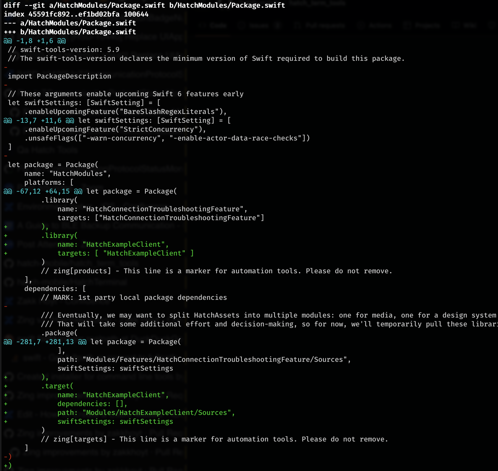
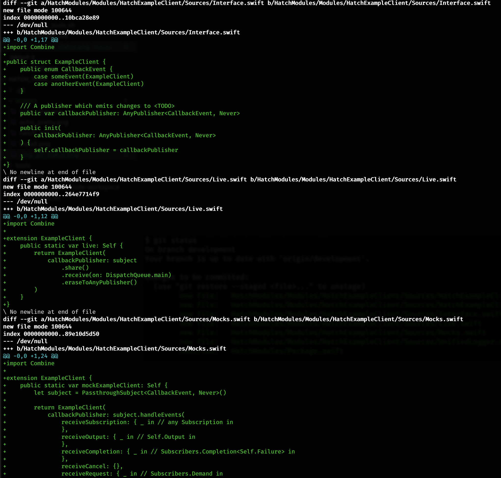

# About

`zing` is a CLI tool to assist in creating new `HatchModules`: 
* Creates boilerplate folders, files
* Updates `Package.swift` with new module. 
* Adds default `DocC` folder, files
* Adds `UnifiedLogger.swift` (a standardized wrapper for `os.Logger`)
* Generates starting Swift files/code. `Live.swift`, `Interface.swift`, etc...
* Adds starting `unit`, `integration`, and `UI` tests
* Supports `--dry-run` (like a preview)
* Written in `Swift`, easy to modify


# Usage

## Help

Show help and subcommands
```sh
$ zing --help
OVERVIEW: A utility to assist in generating packages for HatchModules

USAGE: zing-command <subcommand>

OPTIONS:
  --version               Show the version.
  -h, --help              Show help information.

SUBCOMMANDS:
  create (default)        Creates a new HatchModule
  delete                  Deletes an existing module

  See 'zing-command help <subcommand>' for detailed help.
```

## Help for `create` mode 

Show help for the `create` subcommand (default subcommand if not specified)
```sh
$ zing create --help
OVERVIEW: Creates a new HatchModule

USAGE: zing-command create --package-dir <package-dir> --name <name> [--additional-directories <additional-directories>] [--test-types <test-types> ...] [--write-with-swift-6] [--debug] [--dry-run]

OPTIONS:
  --package-dir <package-dir>
                          Path to the HatchSleep-iOS/HatchModules Package (where HatchModules/Package.swift lives)
  --name <name>           The name of the Module. EX: HatchFeatureThing
  --additional-directories <additional-directories>
                          Additional directories to nest the new Module inside (folder inside of HatchModules/)
  --test-types <test-types>
                          Zero or more types of tests to create targets for (values: unit, integration, ui; default: unit)
  --write-with-swift-6    (Experimental) Use Swift 6s new command line support for adding targets, products, and dependencies.
  --debug                 Print debug information to stderr
  --dry-run               Treat as a dress rehearsal. Writes would be actions to stderr
  --version               Show the version.
  -h, --help              Show help information.
```


# An Example

Suppose we use `zing` to create a new module named `HatchExampleClient`.

## Creating a Module

Try creating a package using `--dry-run`. 
```sh
# Will print would-be content, but not actually write files
zing create \
--name "HatchExampleClient" \
--package-dir "$NIGHTLIGHT_REPO/HatchModules" \
--dry-run
```

Or go for it (you're using `git` after all)

```sh
# Will print would-be content, but not actually write files
zing create \
--name "HatchExampleClient" \
--package-dir "$NIGHTLIGHT_REPO/HatchModules"
```

#### Here is what a `git status` might look like


#### Updates `Package.swift`



#### And here is some of the generated starting code




# Installation 

There are two way to install `zing`: 

## Pre-compiled

To install compiled binaries, paste this into your terminal. 
```sh
# Downloads the `Hatch Terminal Tools` and installs them under `~/.hatch/bin`.
/bin/zsh -c "$(curl -fsSL https://raw.githubusercontent.com/hatch-mobile/hatch_term_tools/main/install_tools.sh)"
```

Refresh your environment
```sh
# Open a new terminal or refresh your instance
source ~/.zshrc`
```

Verify your install
```sh
zing  --version
# 2.0.3
```

## Compile from Source

If you wish to compile/install yourself, see [HatchTerminal](https://github.com/hatch-mobile/HatchTerminal). 


# References
* [HatchTerminal](https://github.com/hatch-mobile/HatchTerminal): Shell utilities written in Swift (including Zing v2)
* [HatchTermTools](https://github.com/hatch-mobile/hatch_term_tools): Pre-compiled binaries (from HatchTerminal) and installer.


